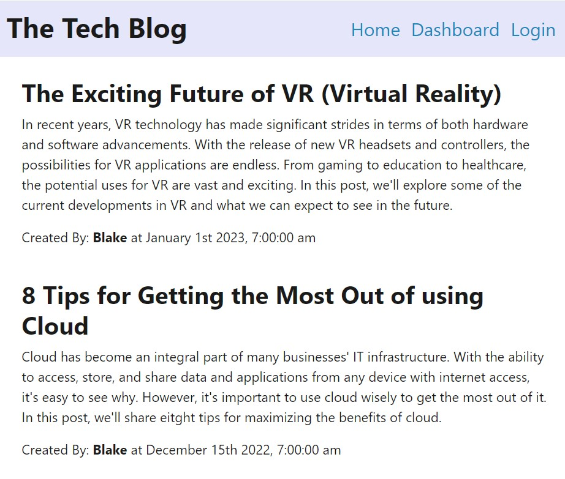

# Tech_Blog

## Description
The Tech Blog application is a CMS-style blog site similar to a Wordpress site, where developers can publish their blog posts and comment on other developers’ posts as well. This application follows the MVC paradigm in its architectural structure, using Handlebars.js as the templating language, Sequelize as the ORM, and express-session npm package for authentication.

## Table of Contents

- [Installation](#installation)
- [Usage](#usage)
- [Contributing](#contributing)
- [License](#license)

## Installation
To install my project use the following link: https://github.com/dianavw8/Tech_Blog and follow these simple directions:

Above the list of files, click on the "Code" button.

Copy the URL for the repository.

Open Git Bash.

Change the current working directory to the location where you want the cloned directory.

Type git clone, and then paste the URL you copied earlier.

Press Enter to create your local clone.

For more help and information achiving this, check out the following website: https://docs.github.com/en/repositories/creating-and-managing-repositories/cloning-a-repository

## Usage
The refactored website can be found at:

The following image demonstrates the application's appearance and functionality:

## License

MIT License link: https://github.com/babel/babel/blob/master/LICENSE

## Contributing

The following are contributers to the making of the E-commerce Back End:

https://shields.io/

https://choosealicense.com/

https://opensource.org/licenses##